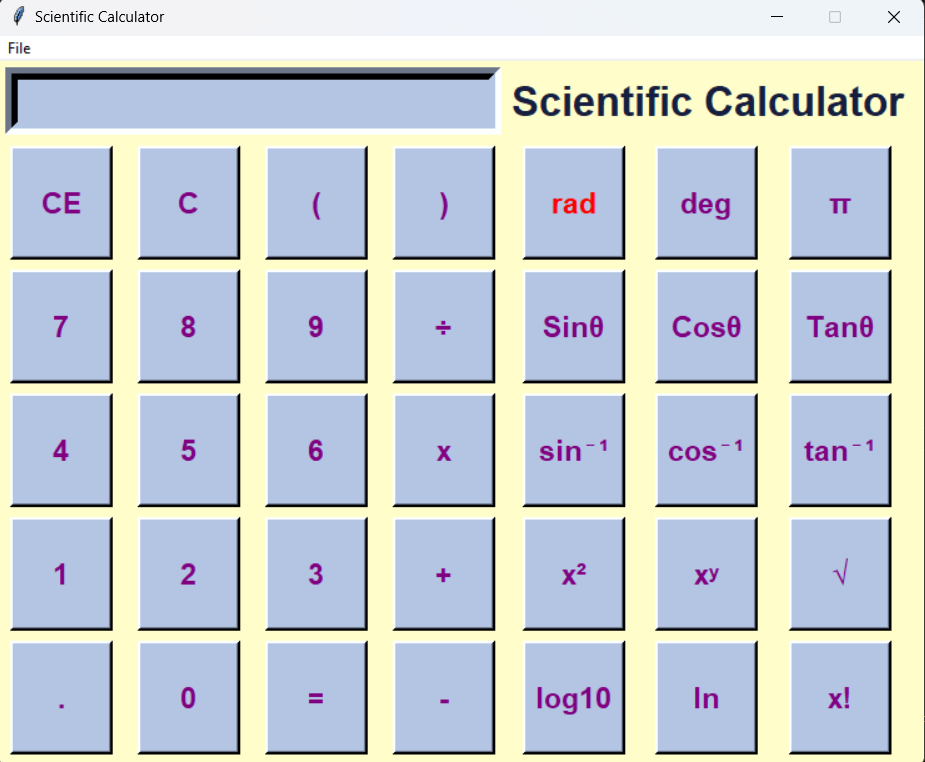

# Scientific Calculator

## Description
This is a scientific calculator built using Python and Tkinter. It supports basic arithmetic operations as well as advanced scientific functions such as trigonometric functions, logarithms, and factorials. The calculator allows switching between standard and scientific modes and supports both radians and degrees for trigonometric calculations.

## Requirements

- Python 3.x
- Tkinter (usually included with Python)
- 
## Features

- **Basic Operations**: Addition, subtraction, multiplication, division.
- **Mode Switching**: Toggle between standard and scientific modes.
- **Angle Unit Switching**: Toggle between radians and degrees for trigonometric functions.
- **Advanced Functions**:
  - Trigonometric functions: sin, cos, tan and their inverses.
  - Logarithmic functions: log10, ln.
  - Factorial calculation: x!.
  - Power operations: x^2, x^y.

## Screenshots

